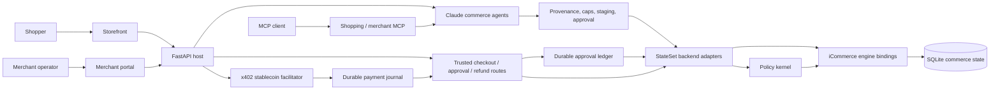

# StateSet iCommerce Agents

[](https://github.com/stateset/icommerce-agents/actions/workflows/ci.yml)
[](https://github.com/stateset/icommerce-agents/tree/v0.9.0)
[](https://www.python.org/)
[](https://nodejs.org/)
[](LICENSE)

A production-oriented reference implementation of Anthropic's `commerce-agents`
architecture on the StateSet iCommerce embedded engine.

It runs a shopping agent and a merchant agent through both a Messages API host and
role-specific MCP servers. Upstream agent guardrails protect the model boundary;
StateSet's policy kernel independently protects governed commerce transactions inside
the engine. The repository makes that boundary visible instead of treating every audit
record as equivalent.

## Quick start

Prerequisites: Python 3.12, Node 20.9 or newer, and a system with glibc 2.34 or newer
for the prebuilt `stateset-embedded` wheel. Older glibc versions can build the engine
from source with Rust and maturin.

```bash
git clone --recurse-submodules https://github.com/stateset/icommerce-agents.git
cd icommerce-agents
./scripts/install.sh
source .venv/bin/activate
npm install
python scripts/run_demo.py --web --tour
```

Open the storefront at <http://localhost:3000> and the merchant portal at
<http://localhost:3100>. The keyless tour creates live engine state first, including a
completed checkout, an approval refusal, an applied price change, and an applied
restock. The portal then renders both evidence types described below.

An Anthropic key is optional for the deterministic demo and test suite. Set
`ANTHROPIC_API_KEY` only when you want live Claude conversations or behavioral evals.
Identity-linked keys also require `ANTHROPIC_WORKSPACE_ID`.

## What this reference implementation proves

The same operator approval and apply pipeline can produce two materially different
artifacts:

```text
price update, TENT-RIDGE-TAN 219.00 -> 199.00
  evidence  kind=activity_log     id=46d07ac4-...

restock of a SKU with no inventory item
  evidence  kind=kernel_receipt   id=5e2eb8f8-...
```

The price update is an ungoverned merchandising mutation. Agent-layer provenance,
guardrail, staging, and approval checks protect it, and the engine records an activity
log. Creating the missing inventory item is a governed command. The engine evaluates
its own policy in the transaction and returns a sealed kernel receipt. The portal
renders these artifacts differently on purpose.

`scripts/denials.py` demonstrates three failure points without calling a model:

1. A cart write naming a product the model never observed is blocked by provenance.
2. A merchant apply without operator approval is blocked by the agent layer.
3. A `10,000.00` refund against a `219.00` payment is rejected by the engine inside
   the transaction with `commerce.refund.exceeds_captured` and a receipt id.

The first two protect the application from a misbehaving model. The third holds for
every caller, including one that bypasses the agent entirely.

## Architecture



The MCP merchant surface deliberately has no approval or refund tool. A model may
stage a proposal, but only a trusted operator route can approve its exact SHA-256
digest or issue a digest-bound refund. Apply claims approval once, leases affected
targets across processes, rechecks the reviewed `before` state, and blocks ambiguous
outcomes until an operator reconciles observed live state.

## Enforcement at a glance

| Operation | Agent/application layer | Engine policy kernel | Evidence |
|---|---|---|---|
| Add or update cart | Provenance and option checks | Not governed | Cart state |
| Checkout | Human-clicked host route | `checkout.commit` | Sealed kernel receipt |
| Stablecoin checkout | Immutable cart-bound x402 quote, verify/settle, replay barrier | `checkout.commit` after settlement | Chain transaction + sealed kernel receipt |
| Stage merchant change | Provenance and guardrails | No live mutation | Staged proposal + digest |
| Apply price, content, promotion, or campaign change | Approval, single claim, target lease, stale-preview check | Not governed | Activity-log id |
| Restock a new SKU | Same apply controls | `inventory.item.create` | Sealed kernel receipt |
| Engine refund | Dedicated refund authority, exact-decimal, digest-bound operator route | `payments.create_refund` with required approval | Sealed success or refusal receipt |
| Stablecoin refund | Dedicated refund authority, human proposal, atomic balance reservation, idempotent treasury adapter | Adapter ledger; x402 has no refund operation | Chain transaction + append-only refund events |

Engine refunds and stablecoin refunds are separate paths. The stablecoin path is only
advertised when an HTTPS treasury adapter is configured; otherwise `/capabilities`
reports that deployment integration is required. The GA gate still requires evidence
that the chosen provider returned funds on-chain and reconciled accounting.

This deployment enables five governed commands in `config/kernel-policy.json`. Only
three have production code paths: `checkout.commit`, `inventory.item.create`, and
`payments.create_refund`. The engine governs the transaction spine, not general
merchandising. [The complete write-by-write account](docs/enforcement.md) names every
exception and avoids implying broader kernel coverage.

## Capabilities

- One seeded ACME Supply store backed by a real `stateset-embedded` SQLite engine.
- Shopping search, catalog, product detail, cart, checkout, and order-history flows.
- Disabled-by-default x402 v2 stablecoin checkout with exact engine totals, short-lived
  cart/address/payer-bound quotes, facilitator verification and settlement, durable
  replay protection, idempotent order completion, and fail-closed reconciliation state.
- Merchant analytics, listings, inventory alerts, staged changes, approval, apply,
  and explicit reconciliation for ambiguous outcomes.
- Human-only refund preview/apply with exact decimal amounts, canonical proposal
  digests, idempotency, kernel approval evidence, and sealed receipts.
- Provider-neutral stablecoin refund contract with atomic over-refund prevention,
  dedicated refund authorization, idempotent treasury submission, transaction evidence,
  and fail-closed reconciliation.
- Demo identity for local use and production JWT authentication with issuer, audience,
  expiry, role/scope, tenant, and token-subject/session binding checks.
- Same-origin storefront and portal BFFs keep production bearer tokens in secure
  HttpOnly cookies, restrict forwarded headers, and reject cross-site mutations.
- Explicit session termination, configurable expiry, and durable principal/cart
  bindings plus transcript/provenance state that survive worker changes and host
  restarts; database leases and OS-held turn locks prevent paused-worker takeover.
- Atomic per-principal request limits shared by every host worker, with role-separated,
  hashed buckets and production startup refusing a disabled limiter.
- Request correlation propagated into checkout/refund kernel envelopes, secure response
  headers, restricted CORS, and logs that omit tokens, session ids, and bodies.
- Disabled-by-default, separately authenticated Prometheus metrics with low-cardinality
  route labels and no customer, operator, session, payment, or request identifiers.
- Deterministic response backstops for two historical live-eval failure modes, without
  hiding the raw model score or weakening the behavioral graders.
- Next.js 16 / React 19 storefront and merchant portal, exercised in CI by Chromium
  against a live host and real engine state.

## Run modes

```bash
# Host only on :8000
python scripts/run_demo.py

# Host plus storefront (:3000) and merchant portal (:3100)
python scripts/run_demo.py --web

# Populate and display the complete keyless evidence tour
python scripts/run_demo.py --web --tour

# Deterministic refusals; no API key
python scripts/denials.py

# One live conversation per role; skips cleanly without a key
python scripts/smoke_chat.py

# Six live behavioral cases; skips cleanly without a key
python -m evals.run
```

Live chat is available through `POST /shopping/chat`, `POST /merchant/chat`, either web
application, the smoke script, or the eval runner. With no key, `/capabilities` reports
`unconfigured` while all deterministic engine and operator flows remain usable.

## HTTP and MCP interfaces

The FastAPI host exposes:

- Shopping: session start/end, streaming chat, cart reads/writes, checkout, and orders.
- Stablecoin: authenticated x402 quote/settle and shopper-scoped payment status routes.
- Stablecoin operations: merchant-scoped recovery queue and externally verified
  settlement reconciliation; ambiguous settlement is never automatically retried.
- Merchant: session start/end, streaming chat, staged-change approval, apply state,
  reconciliation, and governed refund preview/apply.
- Operations: `/capabilities`, `/healthz`, `/readyz`, and authenticated opt-in
  `/metrics`.

All `/shopping/*` and `/merchant/*` commerce reads and writes share their role's
session boundary. `GET /shopping/orders` is customer-scoped; cart and merchant-change
reads are session-scoped. Route definitions and request models live in `host/app.py`.

The separate MCP servers expose 13 shopping tools and 18 merchant tools over the same
backends and gates. They are loopback-oriented, principal-scoped processes—not public
multi-tenant services. See [the MCP deployment guide](docs/mcp.md) before exposing
them through an authorization gateway.

## Production configuration

Local demo authentication uses seeded identities and must not be exposed publicly.
Enable verified bearer authentication for a deployment:

```bash
export ICOMMERCE_ENVIRONMENT=production
export ICOMMERCE_AUTH_MODE=jwt
export ICOMMERCE_JWT_ISSUER=https://identity.example.com/
export ICOMMERCE_JWT_AUDIENCE=icommerce-host
export ICOMMERCE_JWKS_URL=https://identity.example.com/.well-known/jwks.json
export ICOMMERCE_ALLOWED_ORIGINS=https://shop.example.com,https://merchant.example.com
export ICOMMERCE_SESSION_TTL_SECONDS=28800
export ICOMMERCE_CHAT_LEASE_SECONDS=900
export ICOMMERCE_STALE_APPLY_SECONDS=900
export ICOMMERCE_METRICS_TOKEN=replace-with-32-plus-byte-monitoring-secret
export ICOMMERCE_RATE_LIMIT_PER_MINUTE=120
# Server-only value used by each Next.js BFF.
export ICOMMERCE_API_URL=https://api.example.com
```

Public deployments should use asymmetric JWKS verification. The HS256 option exists
for tests and controlled private environments, requires at least 32 bytes, and is
mutually exclusive with JWKS. Direct no-payment checkout and its fictional address are
demo-only; authenticated deployments fail closed unless a configured payment rail
settles first.

Stablecoin checkout is a separately enabled alternative rail. It requires an x402 v2
facilitator, public HTTPS API origin, reviewed EVM network/token/recipient configuration,
and an external signing client. It never stores a payer private key. See the
[stablecoin checkout guide](docs/stablecoin-checkout.md) for configuration, protocol,
failure recovery, and the boundaries that remain deployment responsibilities.

Principal/cart bindings, chat transcripts and provenance, approvals, target leases, and
stablecoin payments are durable and cross-process safe. A database lease and an
OS-held turn lock admit only one worker for each session, even if a process pauses
past lease expiry. Another worker can recover after that process exits and its lease
expires. Expired identity, cart-binding, and conversation records are purged together.
The [installation and deployment guide](docs/install.md) documents every variable and
trust boundary.

## Verification

```bash
ruff check .
ruff format --check .
pytest
python scripts/check.py
python scripts/denials.py
npm audit --audit-level=high
npm run build --workspace web/storefront
npm run build --workspace web/portal
```

Required CI performs those deterministic checks, runs the keyless tour twice against
the same database, and drives a real headless browser against both built web apps. It
does not make paid model calls. A separate protected workflow runs all twelve live Claude
behavioral evals three times on a weekly schedule and on manual dispatch.

Production/GA publication is separately fail-closed: the protected release workflow
requires fresh external evidence bound to the exact commit, reruns verification, and
publishes checksummed source, an SPDX SBOM, and GitHub build provenance. See the
[release process](docs/releasing.md).

The last documented raw-model run scored **4/6 on 2026-09-03**. Prompt and host
backstops now address both observed failure modes, but that historical score is not
rewritten without another live run. [Testing and eval evidence](docs/testing.md)
explains exactly what green CI proves—and what it does not.

## Repository map

- `vendor/commerce-agents/` — pinned upstream architecture as an unmodified submodule.
- `engine_backend/` — `agent_config.py`, `analysis.py`, `apply.py`, `catalog.py`,
  `content.py`, `custom_objects.py`, `kernel.py`, `listings.py`, `merchant.py`,
  `money.py`, `reconciliation.py`, `refunds.py`, `search.py`, `seed.py`, `staging.py`,
  `stablecoins.py`, `store.py`, and `storefront.py` implement the StateSet adapters and
  durable controls.
- `engine_backend/async_utils.py` — cancellation-safe completion of engine work
  before releasing operation locks; see the [integration review](docs/integration-review.md).
- `engine_backend/turn_locks.py` — OS-held chat ownership that prevents a paused
  worker from being replaced solely because its database lease expired, plus
  merchant apply/reconciliation exclusion during stale-attempt recovery.
- `host/` — FastAPI sessions, JWT identity, streaming agents, human approval/refund
  routes, response policy, metrics, and operational endpoints.
- `mcp_servers/` — role-specific MCP entry points over the same adapters and gates.
- `web/storefront/`, `web/portal/` — customer and operator applications.
- `config/` — deployment-owned kernel policy and principal; never model input.
- `evals/` — six structural graders for rules that still depend on model behavior.
- `scripts/` — install, demo, denial, drift, tour, browser, and live smoke tooling.
- `tests/` — deterministic engine, host, MCP, concurrency, security, and web coverage.

## Documentation

- [Install and production configuration](docs/install.md)
- [Production operations and backup/restore](docs/operations.md)
- [Release process and production evidence](docs/releasing.md)
- [GA readiness and remaining deployment gates](docs/ga-readiness.md)
- [Supported deployment envelope](SUPPORT.md)
- [Security reporting and supported versions](SECURITY.md)
- [Enforcement boundaries](docs/enforcement.md)
- [Backend-to-engine mapping](docs/mapping.md)
- [MCP deployment](docs/mcp.md)
- [Stablecoin checkout](docs/stablecoin-checkout.md)
- [Testing scope and live eval record](docs/testing.md)
- [Workflow design](.github/workflows/README.md)

Released under the [MIT License](LICENSE).
